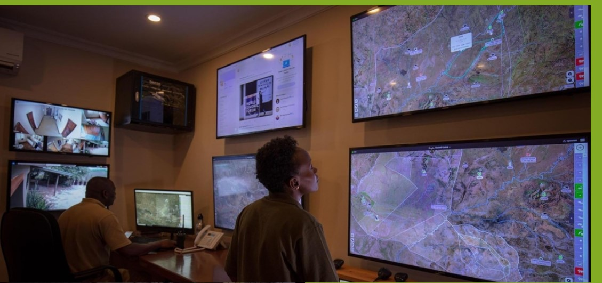

# Anyoop wildlife monitoring application 

## Overview 

The Anyoop Wildlife System's Monitor App is a groundbreaking solution meticulously crafted to address the intricate challenges of wildlife conservation in South Sudan. Developed with innovation at its core, this mobile and web application serves as a comprehensive tool, integrating cutting-edge technology, citizen engagement, and artificial intelligence to revolutionize the landscape of wildlife preservation.This is a simple mobile app for the purpose of monitoring the wild life and controlling the habitat, prevent human-wild conflict and inexcessive poaching. This application is developed using React and Node.js. 
  

## Purpose and Scope
The primary purpose of this application is to provide a holistic approach to wildlife conservation by tackling habitat destruction, poaching, and human-wildlife conflicts. Positioned as a pioneering force in the realm of conservation, the app strives to foster a sustainable coexistence between humans and wildlife. The scope encompasses real-time monitoring, anti-poaching intelligence, early warning systems, standardized crowdsourced data, and community engagement features.

## features 

* Real-time Monitoring
* Anti-poaching Intelligence
* Early Warning System
* Standardized Crowdsourced Data Hub
* Community Engagement and Education

## User Classes and Characteristics
* User
* Administrator
* Observer

## installation 

To install the application, run the following command: `npm install` in your terminal or cmd. This will download all the dependencies for the application.
1. clone the repository using `git clone` command
2. run `npm install` command to install the dependencies
3. run `npm start` command to start the application

## Running the application 
To run the application, run the following command: `npm start` in your terminal or cmd. This will start the application.

The user interface of the application is displayed on the browser.
To add a new animal, click on 'Add Animal' button and fill in the details.

## technology used 
Node.js
React
HTML
CSS
JavaScript

## author
Joshua Malong

## license 
MIT License

## contact

Email: j.malong@alustudent.com

## acknowledgment

This application is developed using React and Node.js. The project structure was created by following along with the tutorial.This project was built as part of the Microverse curriculum.This project was built as part of the Microverse curriculum.

## References 
<https://www.wildlifeinstitute.org/conservation-of-wildlife/endangered-species/giant-schipmunks>
<http://pets4homes.org/>

